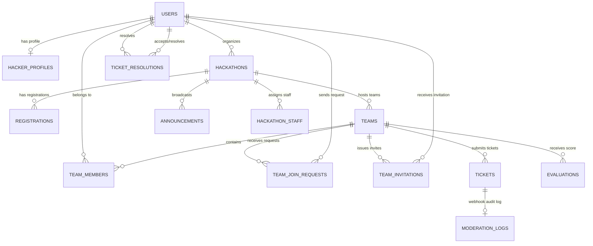

# Database Design

This document details the database schema and storage strategy for the **Matrix Hackathon Command Platform** (PostgreSQL primary database + Redis memory cache).

---

## Database Architecture Overview
The platform uses a hybrid storage architecture:
1. **PostgreSQL** (Primary Relational Database): Guarantees transactional ACID integrity for core user data, registrations, teams, invitations, and ticket lifecycle.
2. **Redis** (In-Memory Key-Value Store): Handles rate-limiting counters (Token Bucket algorithm) and caches the active mentor ticket queue to offload heavy database read requests during polling.

---

## Entity-Relationship Diagram (ERD)

---

## 1. PostgreSQL Schema & Tables

### `users`
Core identity table representing all system actors (Hackers, Mentors, Admins, etc.).
- **ID Column**: `id` UUID PRIMARY KEY (auto-generated)
- **Email Index**: Unique constraint on `email`.
- **Role Constraint**: Enforces one of: `SuperAdmin`, `Organizer`, `Judge`, `Mentor`, `Hacker`, `Admin`, `Manager`, `Agent`, `User`, `Moderator`.
- **Tokens**: `fcm_token` and `apns_token` store push notification registration identifiers.

| Column | Type | Constraints | Description |
|---|---|---|---|
| `id` | UUID | PRIMARY KEY, DEFAULT gen_random_uuid() | Unique identifier |
| `name` | VARCHAR(255) | NOT NULL | User's full name |
| `email` | VARCHAR(255) | UNIQUE, NOT NULL | Login email |
| `password_hash` | VARCHAR(255) | NOT NULL | Bcrypt hashed password |
| `role` | VARCHAR(50) | NOT NULL | System permissions role |
| `fcm_token` | VARCHAR(255) | NULL | Android/Web push registration token |
| `apns_token` | VARCHAR(255) | NULL | iOS push registration token |
| `status` | VARCHAR(50) | NOT NULL, DEFAULT 'active' | User state ('active', 'deactivated') |
| `created_at` | TIMESTAMPTZ | DEFAULT NOW() | Record creation date |

---

### `hackathons`
Events hosted on the multi-tenant platform.

| Column | Type | Constraints | Description |
|---|---|---|---|
| `id` | UUID | PRIMARY KEY, DEFAULT gen_random_uuid() | Unique identifier |
| `organizer_id` | UUID | REFERENCES users(id) ON DELETE CASCADE | Hackathon owner/creator |
| `title` | VARCHAR(255) | NOT NULL | Event name |
| `description` | TEXT | NULL | Details and rules |
| `cover_image` | VARCHAR(255) | NULL | URL for logo/banner |
| `tracks` | JSONB | NULL | List of tracks (e.g., AI, Web3) |
| `start_date` | TIMESTAMPTZ | NOT NULL | Start timestamp |
| `end_date` | TIMESTAMPTZ | NOT NULL | Submission deadline |
| `registration_status`| VARCHAR(50) | DEFAULT 'open' | Status ('open', 'closed') |
| `is_approved` | BOOLEAN | DEFAULT FALSE | Event validation status |
| `created_at` | TIMESTAMPTZ | DEFAULT NOW() | Creation timestamp |

---

### `registrations` (Hacker Profiles)
Hackers registered specifically for a hackathon. Enforces a composite unique key constraint on `(user_id, hackathon_id)`.

| Column | Type | Constraints | Description |
|---|---|---|---|
| `id` | UUID | PRIMARY KEY, DEFAULT gen_random_uuid() | Registration ID |
| `user_id` | UUID | REFERENCES users(id) ON DELETE CASCADE | The hacker |
| `hackathon_id` | UUID | REFERENCES hackathons(id) ON DELETE CASCADE | The event |
| `github_url` | VARCHAR(255) | NULL | GitHub profile |
| `linkedin_url` | VARCHAR(255) | NULL | LinkedIn profile |
| `skills` | JSONB | NULL | Skill list tags (JSON array string) |
| `team_preference` | VARCHAR(50) | DEFAULT 'Solo' | Status: 'Solo', 'Looking for Team', 'Has Team' |
| `approval_status` | VARCHAR(50) | DEFAULT 'Pending' | Registration state: 'Pending', 'Accepted', 'Rejected' |
| `resume_url` | TEXT | NULL | Link to portfolio resume |
| `created_at` | TIMESTAMPTZ | DEFAULT NOW() | Timestamp |

---

### `teams`
Hackathon project groups. Mapped 1:1 with CometChat group channels using `team.id` as the CometChat `GUID`.

| Column | Type | Constraints | Description |
|---|---|---|---|
| `id` | UUID | PRIMARY KEY, DEFAULT gen_random_uuid() | Mapped as CometChat GUID |
| `hackathon_id` | UUID | REFERENCES hackathons(id) ON DELETE CASCADE | Associated event |
| `team_name` | VARCHAR(255) | NOT NULL | Name of the team |
| `invite_code` | VARCHAR(50) | UNIQUE, NOT NULL | Team code for joining |
| `repository_url` | VARCHAR(255) | NULL | GitHub repo link |
| `is_submitted` | BOOLEAN | DEFAULT FALSE | Project submission flag |
| `leader_id` | UUID | REFERENCES users(id) ON DELETE SET NULL | Team creator/leader |
| `is_winner` | BOOLEAN | DEFAULT FALSE | Indicates if team won a prize |
| `created_at` | TIMESTAMPTZ | DEFAULT NOW() | Timestamp |

---

### `team_members`
Many-to-many relationship mapping users into teams.
- **Primary Key**: `(team_id, user_id)`

---

### `tickets` (Mentor Requests)
Stores hacker requests for technical help. Mapped 1:1 with isolated CometChat private groups using the ticket ID as the CometChat `GUID`.

| Column | Type | Constraints | Description |
|---|---|---|---|
| `id` | UUID | PRIMARY KEY, DEFAULT gen_random_uuid() | Ticket ID (CometChat support GUID) |
| `hackathon_id` | UUID | REFERENCES hackathons(id) ON DELETE CASCADE | Associated event |
| `team_id` | UUID | REFERENCES teams(id) ON DELETE CASCADE | Requester team |
| `assigned_mentor_id` | UUID | REFERENCES users(id) ON DELETE SET NULL | Mentor helping out |
| `description` | TEXT | NOT NULL | Issue details |
| `status` | VARCHAR(50) | DEFAULT 'Open' | 'Open' (waiting), 'Active' (claimed), 'Resolved' |
| `created_at` | TIMESTAMPTZ | DEFAULT NOW() | Submission timestamp |

---

### `moderation_logs`
Webhook audit database table. Receives chat and moderation event triggers from CometChat servers.

| Column | Type | Constraints | Description |
|---|---|---|---|
| `id` | UUID | PRIMARY KEY, DEFAULT gen_random_uuid() | Unique identifier |
| `event_type` | VARCHAR(50) | NOT NULL | Event trigger code (e.g. `message_sent`) |
| `sender_uid` | VARCHAR(255) | NOT NULL | Message sender (maps to `users.id`) |
| `sender_name` | VARCHAR(255) | DEFAULT '' | Cached name of sender |
| `receiver_id` | VARCHAR(255) | DEFAULT '' | Message recipient ID (team/ticket GUID) |
| `message_type` | VARCHAR(50) | DEFAULT 'text' | Media/Text classification |
| `message_text` | TEXT | DEFAULT '' | Content |
| `is_flagged` | BOOLEAN | DEFAULT FALSE | Flagged status |
| `flag_category` | VARCHAR(100) | DEFAULT '' | Toxicity, profanity category |
| `flag_reason` | VARCHAR(255) | DEFAULT '' | Keyword triggered |
| `created_at` | TIMESTAMPTZ | DEFAULT NOW() | Timestamp |

#### Indexes:
1. `idx_moderation_logs_flagged` on `(is_flagged, created_at DESC)` (optimises admin logs list).
2. `idx_moderation_logs_sender` on `(sender_uid, created_at DESC)`.

---

## 2. Redis Cache & Storage Design

Redis coordinates transient, fast-mutating, and session data.

### 1. Mentor Ticket Queue Cache
- **Key**: `hackathon:{hackathon_id}:open_tickets`
- **Type**: `Set` or `List`
- **Purpose**: Holds unassigned ticket UUIDs. When a mentor opens the queue page, it fetches active ticket list from Redis to prevent hammering PostgreSQL with heavy queries.

### 2. Rate-Limiting Counters
- **Key**: `ratelimit:{ip_address}:{endpoint_path}`
- **Type**: String (numeric counter)
- **TTL**: 10 seconds (auto-expires)
- **Purpose**: Tracks requests per client to defend auth routes (e.g., login) from brute force attacks.

### 3. Password Reset Tokens
- **Key**: `reset_token:{token}`
- **Value**: User email
- **TTL**: 15 minutes
- **Purpose**: Temporary validation tokens for secure reset links.
